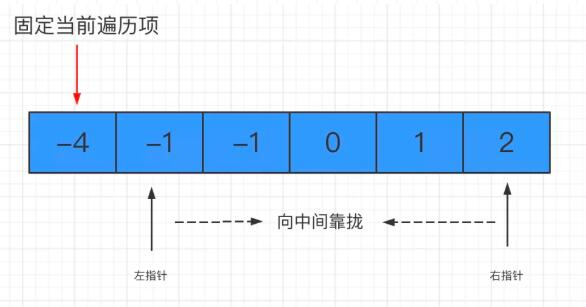

# 三数之和  

难度：`medium`，涉及到的算法知识有数组、双指针  

> **题目描述**  

给你一个包含 `n` 个整数的数组 `nums`，判断 `nums` 中是否存在三个元素 `a`，`b`，`c`，使得 `a + b + c = 0`。请你找出所有满足条件且不重复的三元组。  
注意：答案中不可以包含重复的三元组。  
示例：  

```
给定数组 nums = [-1, 0, 1, 2, -1, -4]，

满足要求的三元组集合为：
[
  [-1, 0, 1],
  [-1, -1, 2]
]
```

> **思路分析**  

和上面的 `两数之和` 一样，如果不认真思考，最快的方式可能就是多层遍历了。但有了前车之鉴，我们同样可以把求和问题变为求差问题：固定其中一个数，在剩下的数中寻找是否有两个数的和这个固定数相加是等于 0 的。  
这里我们采用 `双指针法` 来解决问题，相比三层循环，效率会大大提升。  

#### 双指针法的适用范围比较广，一般像求和、比大小的都可以用它来解决。但是有一个前提：数组必须有序  

因此我们的第一步就是先将数组进行排序：  

```
// 给 nums 排序
nums = nums.sort((a,b)=>{
    return a-b
})
```

然后对数组进行遍历，每遍历到哪个数字，就固定当前的数字。同时左指针指向该数字后面的紧邻的那个数字，右指针指向数组末尾。然后左右指针分别向中间靠拢：  
  
每次指针移动一次位置，就计算一下两个指针指向数字之和加上固定的那个数之后，是否等于 0。如果是，那么我们就得到了一个目标组合；否则，分两种情况来看：  
- 相加之和大于 0，说明右侧的数偏大了，右指针左移  
- 相加之和小于 0，说明左侧的数偏小了，左指针右移  

> **代码实现**  

```
/**
 * @param {number[]} nums
 * @return {number[][]}
 */
const threeSum = function(nums) {
    // 用于存放结果数组
    let res = []
    // 目标值为0
    let sum = 0
    // 给 nums 排序
    nums = nums.sort((a,b)=>{
        return a-b
    })
    // 缓存数组长度
    const len = nums.length
    for(let i=0;i<len-2;i++) {
        // 左指针 j
        let j=i+1
        // 右指针k
        let k=len-1
        // 如果遇到重复的数字，则跳过
        if(i>0&&nums[i]===nums[i-1]) {
            continue
        }
        while(j<k) {
            // 三数之和小于0，左指针前进
            if(nums[i]+nums[j]+nums[k]<0){
                j++
               // 处理左指针元素重复的情况
               while(j<k&&nums[j]===nums[j-1]) {
                    j++
                }
            } else if(nums[i]+nums[j]+nums[k]>0){
                // 三数之和大于0，右指针后退
                k--

               // 处理右指针元素重复的情况
               while(j<k&&nums[k]===nums[k+1]) {
                    k--
                }
            } else {
                // 得到目标数字组合，推入结果数组
                res.push([nums[i],nums[j],nums[k]])

                // 左右指针一起前进
                j++
                k--

                // 若左指针元素重复，跳过
                while(j<k&&nums[j]===nums[j-1]) {
                    j++
                }

               // 若右指针元素重复，跳过
               while(j<k&&nums[k]===nums[k+1]) {
                    k--
                }
            }
        }
    }

    // 返回结果数组
    return res
};
```