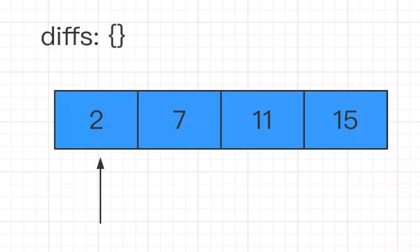
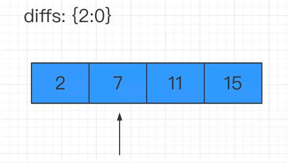

# 两数之和  

难度：easy，涉及到的算法知识有数组、哈希表

> **题目描述**  

给定一个整数数组 `nums` 和一个目标值 `target`，请你在该数组中找出和为目标值的那 **两个** 整数，并返回他们的数组下标。  
你可以假设每种输入只会对应一个答案。但是，数组中同一个元素不能使用两遍。  

**示例：**  
```
给定 nums = [2, 7, 11, 15], target = 9
因为 nums[0] + nums[1] = 2 + 7 = 9
所以返回 [0, 1]
```

> **思路分析**  

大多数同学看到这道题目，心中肯定会想：这道题目太简单了，不就两层遍历嘛：两层循环来遍历同一个数组；第一层循环遍历的值记为 `a`，第二层循环时遍历的值记为 `b`；若 `a+b = 目标值`，那么 `a` 和 `b` 对应的数组下标就是我们想要的答案。  
这种解法没毛病，但有没有优化的方案呢？🤔  
要知道两层循环很多情况下都意味着 `O(n^2)` 的复杂度，这个复杂度非常容易导致你的算法超时。即便没有超时，在明明有一层遍历解法的情况下，你写了两层遍历，面试官也会对你的印象分大打折扣。🤒  
其实我们可以在遍历数组的过程中，增加一个 `Map` 结构来存储已经遍历过的数字及其对应的索引值。然后每遍历到一个新数字的时候，都回到 `Map` 里去查询 `targetNum` 与该数的差值是否已经在前面的数字中出现过了。若出现过，那么答案已然显现，我们就不必再往下走了。  

我们就以本题中的例子结合图片来说明一下上面提到的这种思路：  
- 这里用对象diffs来模拟map结构：  

  
首先遍历数组第一个元素，此时key为 2，value为索引 0  

- 往下遍历，遇到了 7:  

  
计算 `targetNum` 和 7 的差值为 2，去 `diffs` 中检索 2 这个 `key`，发现是之前出现过的值。那么本题的答案就出来了！  

> **代码实现**  

```
/**
 * @param {number[]} nums
 * @param {number} target
 * @return {number[]}
 */
const twoSum = function (nums, target) {
  const diffs = {};
  // 缓存数组长度
  const len = nums.length;
  // 遍历数组
  for (let i = 0; i < len; i++) {
    // 判断当前值对应的 target 差值是否存在
    if (diffs[target - nums[i]] !== undefined) {
      // 若有对应差值，那么得到答案
      return [diffs[target - nums[i]], i];
    }
    // 若没有对应差值，则记录当前值
    diffs[nums[i]] = i;
  }
};
```